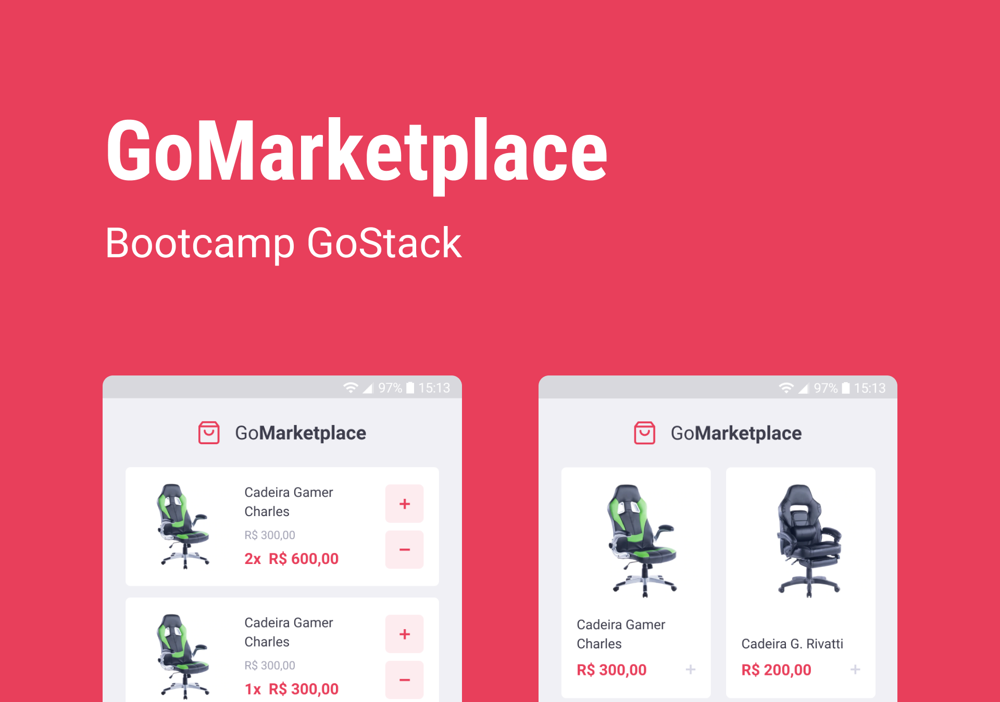

# [Challenge 08 - React Native Fundamentals - GoMarketplace](https://github.com/Rocketseat/gostack-template-fundamentos-react-native)

This challenge consists of the creation of a listing and a cart page

## 💻 Installation
Clone the application and install the dependencies

```
$ git clone git@github.com:cleiver/GoStack11-Desafio08-fundamentos-react-native.git

$ yarn
```

## Running the application

Assuming you alread have the emulator or your device configured to run react native apps:

```
$ yarn android
```
or
```
$ yarn ios
```

